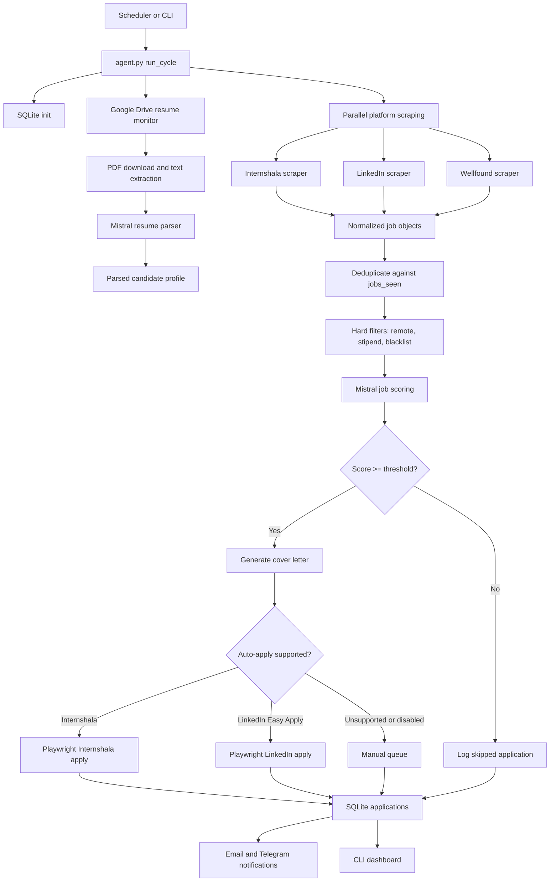
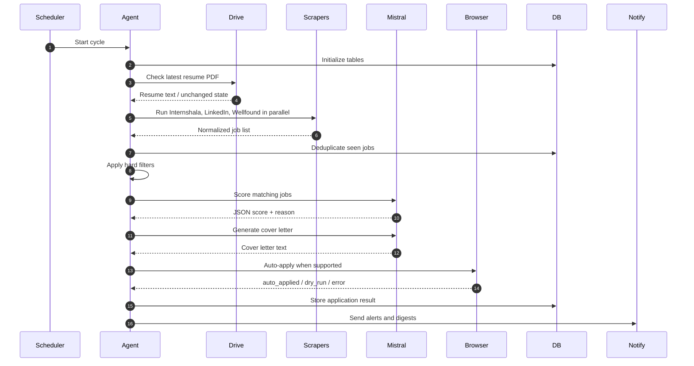
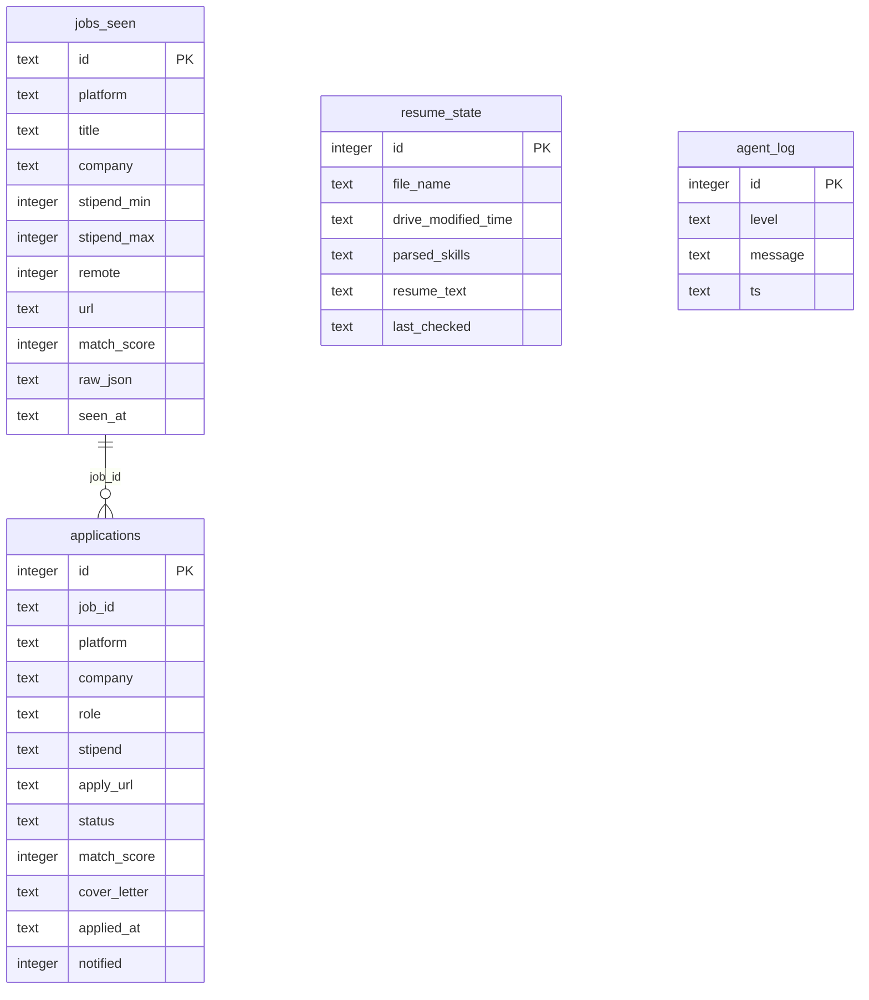

# Intern Hunter

Autonomous internship discovery and application agent for scraping remote internships, ranking them against a candidate profile/resume with Mistral AI, generating tailored cover letters, and auto-applying where the platform flow is supported.

Intern Hunter is built as a production-style agent: it runs headlessly, keeps state in SQLite, handles recurring execution, sends notifications, and records enough data to debug selector failures, LLM output issues, stale sessions, and application flow errors.

## Current Capability

| Capability | Status | Notes |
|---|---:|---|
| Internshala scraping | Implemented | Scrapes skill-specific work-from-home internship pages. |
| LinkedIn scraping | Implemented | Searches remote internship jobs and checks Easy Apply availability. |
| Wellfound scraping | Implemented | Scrapes remote startup internship listings. |
| Mistral job scoring | Implemented | Uses JSON-mode structured output for score and reason. |
| Cover letter generation | Implemented | Uses Mistral to generate a short tailored cover letter. |
| Google Drive resume sync | Implemented | Watches latest PDF resume in a Drive folder and parses it. |
| Internshala auto-apply | Implemented, selector-dependent | Requires a valid saved browser session. |
| LinkedIn auto-apply | Implemented for Easy Apply only | Requires a valid saved browser session. |
| Wellfound auto-apply | Not enabled | Wellfound jobs are routed to manual review. |
| SQLite state tracking | Implemented | Tracks seen jobs, applications, resume state, and logs. |
| Email and Telegram notifications | Implemented | Sends high-priority alerts, digests, and auto-apply confirmations. |
| 6-hour scheduling | Implemented | Supported by APScheduler, GitHub Actions cron, and Oracle systemd deployment. |

## Why This Project Exists

Most job automation scripts fail because they assume the web is stable. Intern Hunter was built to expose and handle the real failure modes of browser-based agents:

- selectors change without warning;
- logged-in sessions expire;
- forms vary across listings;
- LLMs can hallucinate malformed structured output;
- multiple async scrapers can fail independently;
- repeated runs need deduplication and state;
- successful browser clicks do not always mean successful submission.

The project is not just a scraper. It is an agent pipeline with state, scoring, generated artifacts, application actions, and operational tooling.

## Architecture



## Runtime Flow



## Repository Layout

```text
.
|-- agent.py                       # Main orchestration and scheduler entry point
|-- config.template.yaml           # Safe config template without secrets
|-- setup.py                       # Interactive local setup wizard
|-- dashboard.py                   # CLI dashboard for applications, logs, resume state
|-- cloud_deploy.sh                # Oracle Cloud VM deployment script
|-- update_agent.sh                # Push local code changes to Oracle VM
|-- remote_logs.sh                 # Tail Oracle VM service logs
|-- remote_dashboard.sh            # Run dashboard remotely
|-- save_sessions_to_secrets.sh    # Helper for GitHub Actions session secrets
|-- README_ORACLE_SETUP.md         # Detailed Oracle Cloud setup guide
|-- core/
|   |-- database.py                # SQLite schema and queries
|   |-- drive_monitor.py           # Google Drive resume sync and parsing
|   `-- matcher.py                 # Mistral scoring and cover letter generation
|-- scrapers/
|   |-- internshala_scraper.py     # Internshala scraper
|   |-- linkedin_scraper.py        # LinkedIn scraper
|   `-- wellfound_scraper.py       # Wellfound scraper
|-- apply/
|   `-- auto_apply.py              # Playwright auto-apply flows
|-- notify/
|   `-- notifier.py                # Email and Telegram notifications
`-- .github/
    |-- workflows/intern-hunter.yml
    `-- scripts/inject_config.py
```

## Data Model



## Application Statuses

| Status | Meaning |
|---|---|
| `auto_applied` | The agent attempted and completed a supported auto-apply flow. |
| `manual_queue` | The job passed scoring but cannot be safely auto-applied. |
| `skipped` | The job failed hard filters or scored below the threshold. |
| `dry_run` | The pipeline reached apply logic but did not submit anything. |
| `error` | Scraping or application flow failed for that job. |

## Prerequisites

- Python 3.11+
- Playwright Chromium
- Mistral AI API key
- Gmail app password for notifications
- Optional Telegram bot token and chat ID
- Optional Google Drive OAuth credentials for resume syncing
- Saved browser session cookies for Internshala and LinkedIn auto-apply

Install dependencies:

```bash
python -m venv venv
source venv/bin/activate
pip install --upgrade pip
pip install -r requirements.txt
playwright install chromium
```

## Configuration

Create a local config:

```bash
cp config.template.yaml config.yaml
```

Then either edit `config.yaml` manually or run:

```bash
python setup.py
```

Important config sections:

| Section | Purpose |
|---|---|
| `candidate` | Candidate profile, skills, target roles, projects, contact info. |
| `preferences` | Remote-only rule, minimum stipend, score threshold, daily cap. |
| `mistral` | Mistral API key and model names. |
| `google_drive` | Resume folder, OAuth credentials, Drive scopes. |
| `email` | SMTP sender and Gmail app password. |
| `telegram` | Optional instant alert channel. |
| `platforms` | Platform enablement, auto-apply flags, session files, search skills. |
| `agent` | Database path, screenshots path, schedule interval, digest time. |
| `scraping` | Browser delays, timeouts, user agent. |

`config.yaml`, `sessions/`, `credentials/`, and `data/` are intentionally ignored by git.

## Running Locally

Run one full cycle:

```bash
python agent.py
```

Run safely without submitting forms:

```bash
python agent.py --dry-run
```

Run continuously every configured interval:

```bash
python agent.py --schedule
```

Reset skipped-job cache and re-evaluate:

```bash
python agent.py --reset --dry-run
```

Open the CLI dashboard:

```bash
python dashboard.py
```

## Demo Script

For a technical demo, use dry-run mode first. It shows the real agent pipeline without risking accidental submissions.

```bash
source venv/bin/activate
python agent.py --dry-run
python dashboard.py
```

What to show:

1. Scrapers are launched in parallel from `agent.py`.
2. New jobs are deduplicated in SQLite.
3. Hard filters remove low-quality jobs before spending LLM tokens.
4. Mistral scores jobs with JSON-mode structured output.
5. Cover letters are generated only after a job passes the threshold.
6. Internshala and LinkedIn use Playwright for supported auto-apply flows.
7. Wellfound is intentionally kept in the manual queue.
8. The dashboard exposes recent applications, resume state, and logs.

## Deployment Options

### GitHub Actions

The workflow at `.github/workflows/intern-hunter.yml` runs every 6 hours:

```yaml
schedule:
  - cron: "0 */6 * * *"
```

It injects secrets at runtime, restores the SQLite cache, runs the agent once, prints dashboard output, and uploads screenshots as artifacts.

Required GitHub secrets:

| Secret | Required | Purpose |
|---|---:|---|
| `MISTRAL_API_KEY` | Yes | Job scoring and cover letters. |
| `GMAIL_SENDER` | Yes | Notification sender email. |
| `GMAIL_APP_PASSWORD` | Yes | SMTP authentication. |
| `COLLEGE_EMAIL` | No | Extra high-priority alert recipient. |
| `INTERNSHALA_SESSION` | No | Base64 session JSON for auto-apply. |
| `LINKEDIN_SESSION` | No | Base64 session JSON for Easy Apply. |
| `TELEGRAM_BOT_TOKEN` | No | Telegram alerts. |
| `TELEGRAM_CHAT_ID` | No | Telegram alert destination. |

If session secrets are missing, auto-apply is disabled for that platform by `.github/scripts/inject_config.py`.

### Oracle Cloud

`cloud_deploy.sh` deploys the project to an Oracle Cloud Ubuntu VM, installs dependencies, writes `config.yaml`, creates a systemd service, and starts:

```bash
/home/ubuntu/intern_hunter/venv/bin/python agent.py --schedule
```

Useful remote commands:

```bash
bash remote_logs.sh
bash remote_dashboard.sh
bash update_agent.sh
```

See `README_ORACLE_SETUP.md` for the full Oracle Free Tier setup guide.

## Operational Notes

Auto-apply depends on browser sessions and current platform HTML. These are the expected fragile points:

- selectors can become stale;
- login cookies can expire;
- CAPTCHA or bot checks can block runs;
- LinkedIn multi-step forms vary by employer;
- generic text input filling may not answer every custom question correctly;
- a successful click should be verified through screenshots, logs, or confirmation email.

Because of that, `--dry-run`, screenshots, database logs, and manual queue review are part of the intended workflow.

## Failure Handling

| Failure | Handling |
|---|---|
| Scraper fails | Error is logged and other platform results continue. |
| Mistral scoring fails | Job receives score `0` and the error reason is stored. |
| Cover letter generation fails | A fallback letter is produced. |
| Missing browser session | Auto-apply returns `error` or is disabled in GitHub Actions. |
| Unsupported platform apply flow | Job is stored as `manual_queue`. |
| Duplicate job | Skipped through `jobs_seen` TTL-based deduplication. |

## Honest Scope

Intern Hunter currently demonstrates a real autonomous agent pipeline. It should be described as:

> An internship agent that scrapes three platforms, filters and scores jobs against a resume/profile using Mistral AI, generates cover letters, and auto-applies on supported flows while routing unsupported or risky cases to a manual queue.

It should not be described as:

> A fully reliable production auto-apply system across all platforms.

The accurate distinction matters because the core engineering lesson of this project is exactly where agents fail: selectors, stale browser state, structured LLM output, and async orchestration.

## Safety

This project can submit real job applications when `dry_run` is disabled and valid sessions are present. Before running live auto-apply:

1. Confirm `max_applications_per_day`.
2. Run `python agent.py --dry-run`.
3. Review generated cover letters in the database/dashboard.
4. Confirm browser sessions are fresh.
5. Start with one platform enabled.

## License

No license is currently declared. Add one before distributing or accepting external contributions.
